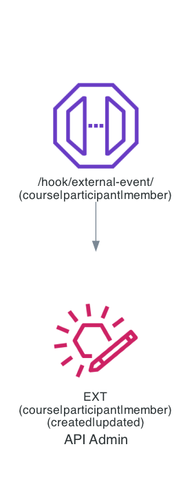
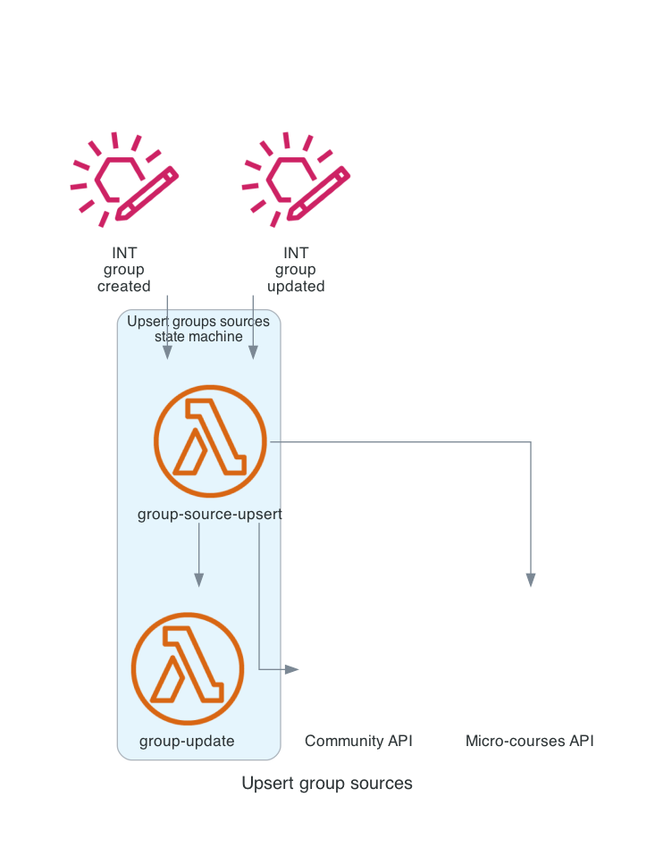
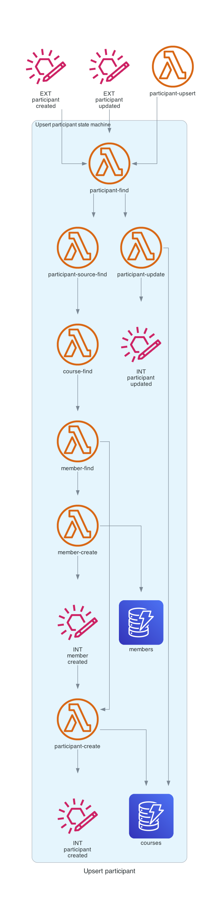
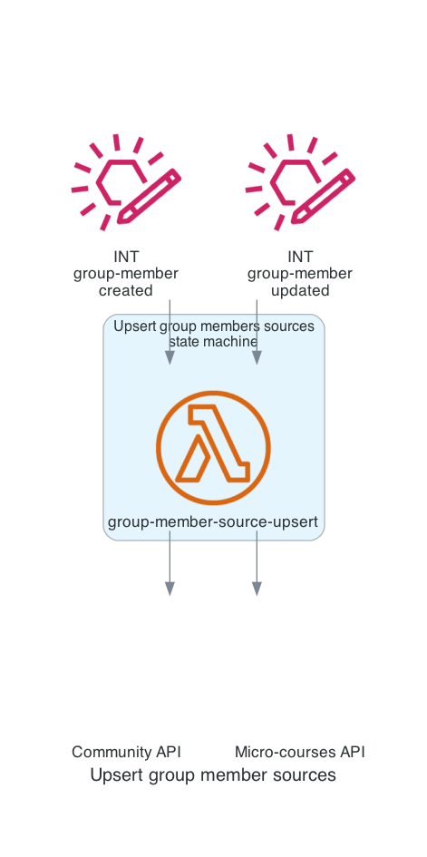
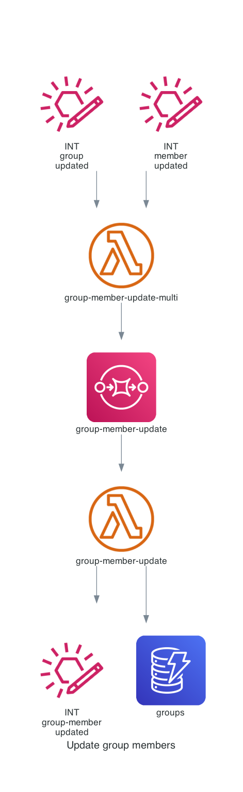
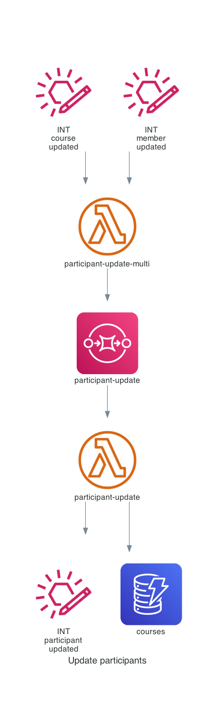
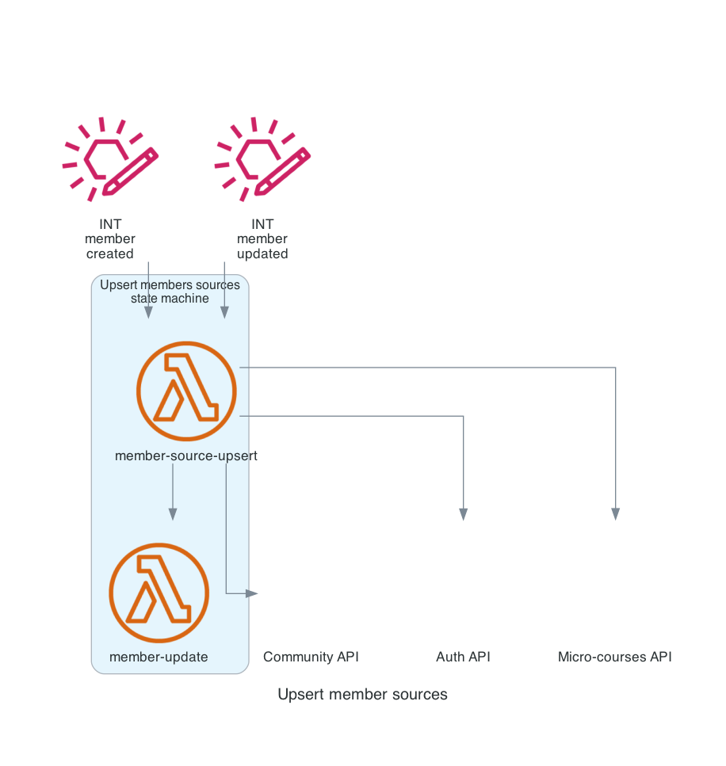

# Course

## Creating / updating a course in the system

#### NOTES

* If a course is updated externally, but does not yet exist in the system, it will be created

Tested!

## Opening a course in the system

Daily scheduled check for courses that are open today

#### NOTES

* This will invoke the functions that follow a course-update (outlined below) e.g. groups will become active, group members will be created, etc.

## Events based on course creation

### Groups

A corresponding group will be created in the system, and in related sources.

Tested!

### Participants / group members

The system will check for the existence of external participants and add them to the system.

#### NOTES

* Members are created, if they don't already exist, as part of participant upsert
* If a course is not yet open, or a participant has an inactive status, group member sources will not be created
* However, if both course and participant are active, group member source will be immediately created and access will be immediately granted

## Events based on course update

### Groups / group members

The group will be updated, which will cause the group sources to be updated AND the group members to be updated; both with new course/group info. Group member sources again will only be affected if course/group and participant/group member statuses are active.

### Participants / group members

This feels like a potential conflict of the previous, but the only info group members are receiving from participants is the status. As this (path for) change is invoked by an update in the course, the group-member-update will result in a `no-change` outcome and therefore will not invoke a group-member-source-upsert.

## Schedule check for change in course status

i.e. is today the day that the course opens.

TBD

# Participant

## Creating / updating a participant in the system

#### NOTES

* If a participant is updated externally, but does not yet exist in the system, it will be created

## Events based on participant creation or update

### Members

### Group members

#### NOTES

* If a course is not yet open, or a participant has an inactive status, group member sources will not be created
* However, if both course and participant are active, group member source will be immediately created and access will be immediately granted

# Member

## Creating a member in the system

Currently only occurs as part of participant-upsert.

## Updating a member in the system

## Events based on member update

Essentially the member info is pushed to all micro-services that use the member entity.

### Participants

### Group members

